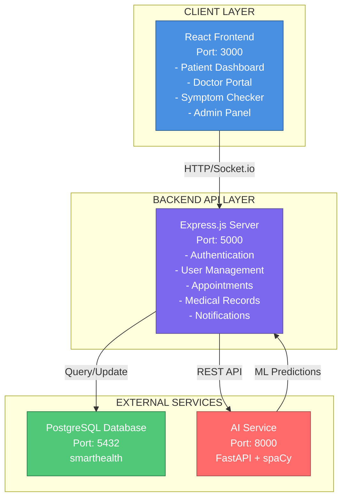

# System Architecture Diagram

```mermaid
graph TB
    subgraph Client["CLIENT LAYER"]
        A["React Frontend<br/>Port: 3000<br/>- Patient Dashboard<br/>- Doctor Portal<br/>- Symptom Checker<br/>- Admin Panel"]
    end
    
    subgraph Backend["BACKEND API LAYER"]
        B["Express.js Server<br/>Port: 5000<br/>- Authentication<br/>- User Management<br/>- Appointments<br/>- Medical Records<br/>- Notifications"]
    end
    
    subgraph Services["EXTERNAL SERVICES"]
        C["PostgreSQL Database<br/>Port: 5432<br/>smarthealth"]
        D["AI Service<br/>Port: 8000<br/>FastAPI + spaCy"]
    end
    
    A -->|HTTP/Socket.io| B
    B -->|Query/Update| C
    B -->|REST API| D
    D -->|ML Predictions| B
    
    style A fill:#4A90E2,stroke:#2E5C8A,color:#fff
    style B fill:#7B68EE,stroke:#5A4C8F,color:#fff
    style C fill:#50C878,stroke:#2D7A4A,color:#fff
    style D fill:#FF6B6B,stroke:#A24A4A,color:#fff
```
