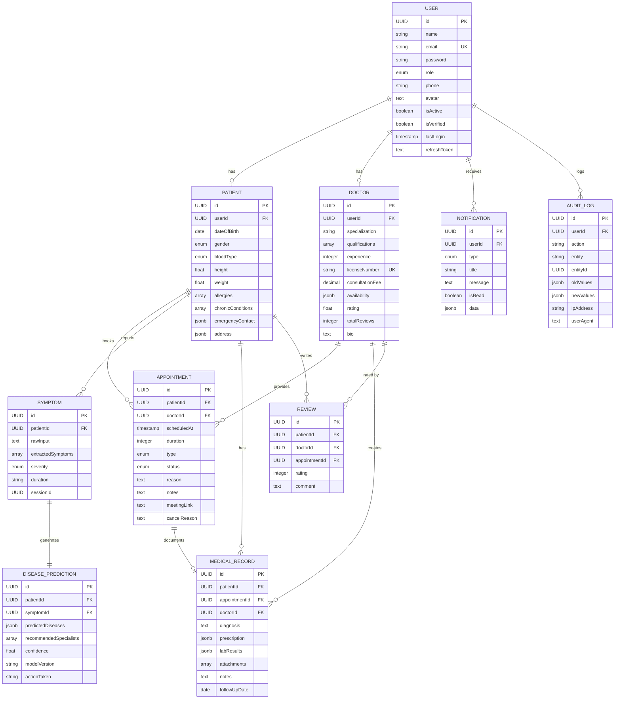

# Database ERD Diagram

```mermaid
erDiagram
    USER ||--o| PATIENT : has
    USER ||--o| DOCTOR : has
    PATIENT ||--o{ APPOINTMENT : books
    DOCTOR ||--o{ APPOINTMENT : provides
    PATIENT ||--o{ SYMPTOM : reports
    SYMPTOM ||--|| DISEASE_PREDICTION : generates
    PATIENT ||--o{ MEDICAL_RECORD : has
    DOCTOR ||--o{ MEDICAL_RECORD : creates
    APPOINTMENT ||--o| MEDICAL_RECORD : documents
    USER ||--o{ NOTIFICATION : receives
    DOCTOR ||--o{ REVIEW : "rated by"
    PATIENT ||--o{ REVIEW : "writes"
    USER ||--o{ AUDIT_LOG : logs

    USER {
        UUID id PK
        string name
        string email UK
        string password
        enum role
        string phone
        text avatar
        boolean isActive
        boolean isVerified
        timestamp lastLogin
        text refreshToken
    }

    PATIENT {
        UUID id PK
        UUID userId FK
        date dateOfBirth
        enum gender
        enum bloodType
        float height
        float weight
        array allergies
        array chronicConditions
        jsonb emergencyContact
        jsonb address
    }

    DOCTOR {
        UUID id PK
        UUID userId FK
        string specialization
        array qualifications
        integer experience
        string licenseNumber UK
        decimal consultationFee
        jsonb availability
        float rating
        integer totalReviews
        text bio
    }

    APPOINTMENT {
        UUID id PK
        UUID patientId FK
        UUID doctorId FK
        timestamp scheduledAt
        integer duration
        enum type
        enum status
        text reason
        text notes
        text meetingLink
        text cancelReason
    }

    SYMPTOM {
        UUID id PK
        UUID patientId FK
        text rawInput
        array extractedSymptoms
        enum severity
        string duration
        UUID sessionId
    }

    DISEASE_PREDICTION {
        UUID id PK
        UUID patientId FK
        UUID symptomId FK
        jsonb predictedDiseases
        array recommendedSpecialists
        float confidence
        string modelVersion
        string actionTaken
    }

    MEDICAL_RECORD {
        UUID id PK
        UUID patientId FK
        UUID appointmentId FK
        UUID doctorId FK
        text diagnosis
        jsonb prescription
        jsonb labResults
        array attachments
        text notes
        date followUpDate
    }

    NOTIFICATION {
        UUID id PK
        UUID userId FK
        enum type
        string title
        text message
        boolean isRead
        jsonb data
    }

    REVIEW {
        UUID id PK
        UUID patientId FK
        UUID doctorId FK
        UUID appointmentId FK
        integer rating
        text comment
    }

    AUDIT_LOG {
        UUID id PK
        UUID userId FK
        string action
        string entity
        UUID entityId
        jsonb oldValues
        jsonb newValues
        string ipAddress
        text userAgent
    }
```
