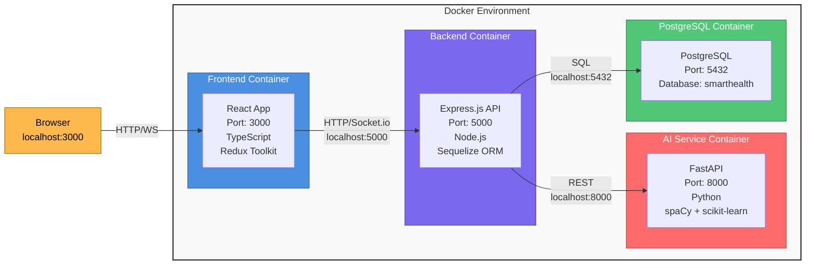

# Docker Deployment Architecture Diagram

```mermaid
graph LR
    subgraph Docker["Docker Environment"]
        subgraph Frontend_Container["Frontend Container"]
            F["React App<br/>Port: 3000<br/>TypeScript<br/>Redux Toolkit"]
        end
        
        subgraph Backend_Container["Backend Container"]
            B["Express.js API<br/>Port: 5000<br/>Node.js<br/>Sequelize ORM"]
        end
        
        subgraph AI_Container["AI Service Container"]
            AI["FastAPI<br/>Port: 8000<br/>Python<br/>spaCy + scikit-learn"]
        end
        
        subgraph DB_Container["PostgreSQL Container"]
            DB["PostgreSQL<br/>Port: 5432<br/>Database: smarthealth"]
        end
        
        F -->|HTTP/Socket.io<br/>localhost:5000| B
        B -->|REST<br/>localhost:8000| AI
        B -->|SQL<br/>localhost:5432| DB
    end
    
    Client["Browser<br/>localhost:3000"]
    Client -->|HTTP/WS| F
    
    style Docker fill:#f9f9f9,stroke:#333,stroke-width:2px
    style Frontend_Container fill:#4A90E2,stroke:#2E5C8A,color:#fff
    style Backend_Container fill:#7B68EE,stroke:#5A4C8F,color:#fff
    style AI_Container fill:#FF6B6B,stroke:#A24A4A,color:#fff
    style DB_Container fill:#50C878,stroke:#2D7A4A,color:#fff
    style Client fill:#FFB84D,stroke:#8B6A00,color:#000
```
