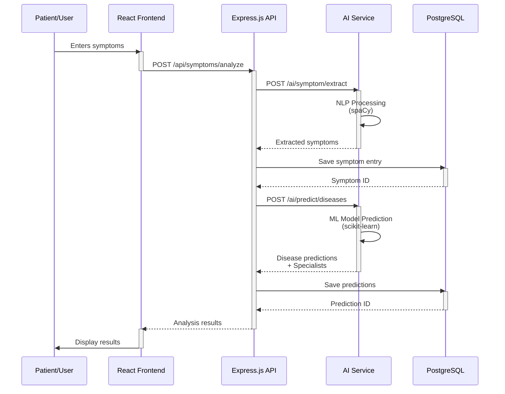

# Symptom Analysis Data Flow Diagram

```mermaid
sequenceDiagram
    participant User as Patient/User
    participant Frontend as React Frontend
    participant Backend as Express.js API
    participant AI as AI Service
    participant DB as PostgreSQL

    User->>Frontend: Enters symptoms
    activate Frontend
    Frontend->>Backend: POST /api/symptoms/analyze
    deactivate Frontend
    
    activate Backend
    Backend->>AI: POST /ai/symptom/extract
    activate AI
    AI->>AI: NLP Processing<br/>(spaCy)
    AI-->>Backend: Extracted symptoms
    deactivate AI
    
    Backend->>DB: Save symptom entry
    activate DB
    DB-->>Backend: Symptom ID
    deactivate DB
    
    Backend->>AI: POST /ai/predict/diseases
    activate AI
    AI->>AI: ML Model Prediction<br/>(scikit-learn)
    AI-->>Backend: Disease predictions<br/>+ Specialists
    deactivate AI
    
    Backend->>DB: Save predictions
    activate DB
    DB-->>Backend: Prediction ID
    deactivate DB
    
    Backend-->>Frontend: Analysis results
    deactivate Backend
    
    activate Frontend
    Frontend->>User: Display results
    deactivate Frontend
```
