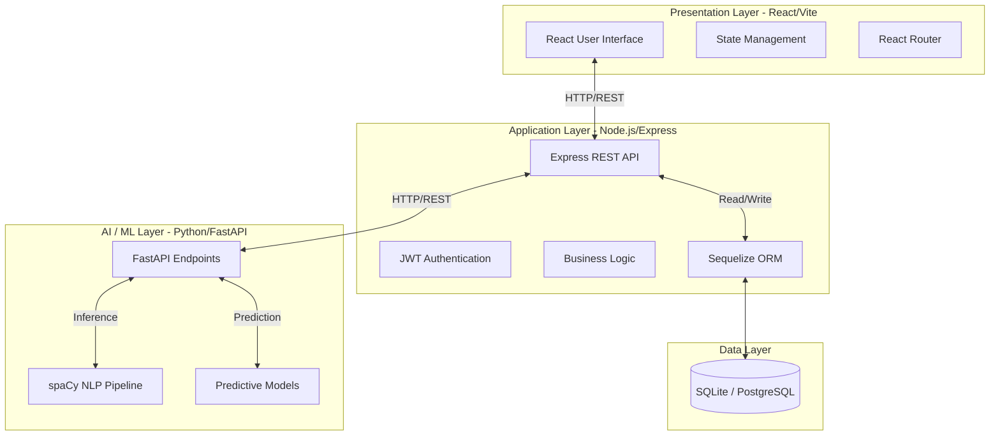
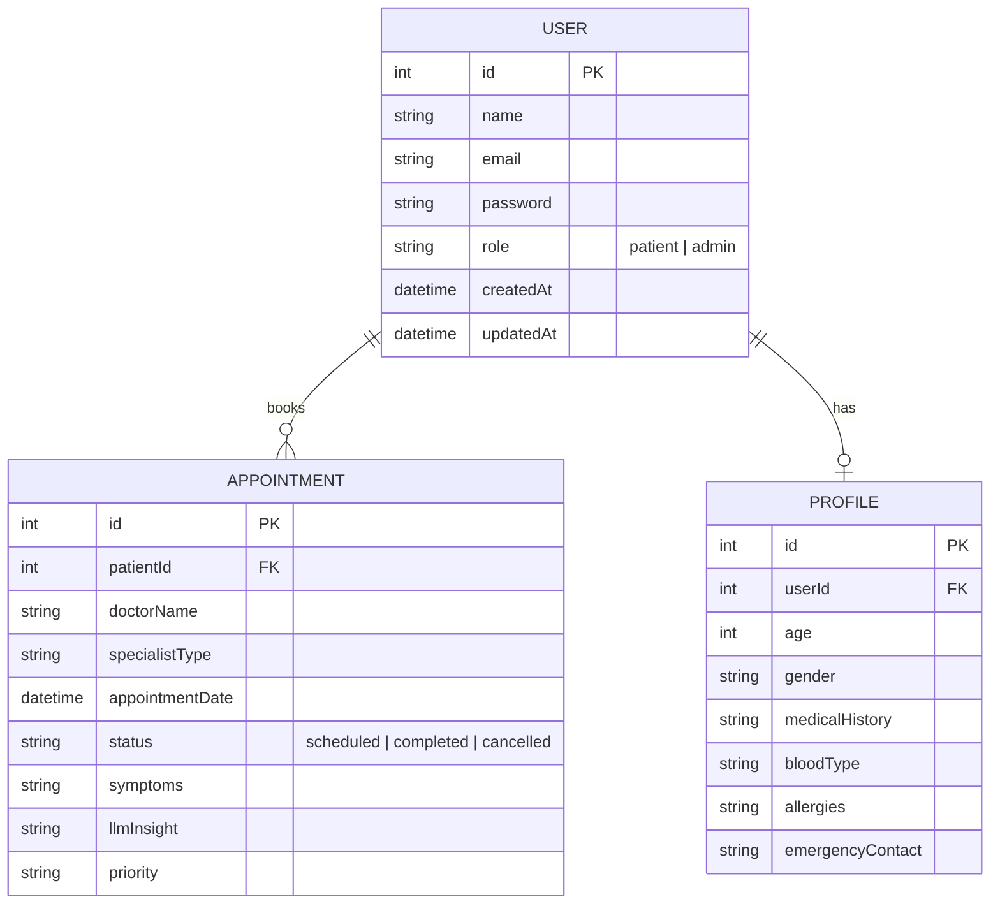

# SmartHealth AI Assistant

[](https://reactjs.org/)
[](https://nodejs.org/)
[](https://fastapi.tiangolo.com/)
[](https://sqlite.org/)
[](https://smarthealth-ai-assistant.vercel.app/)

**🚀 Live Demo:** [https://smarthealth-ai-assistant.vercel.app/](https://smarthealth-ai-assistant.vercel.app/)

SmartHealth is an intelligent, full-stack medical appointment and symptom analysis platform. It leverages advanced Natural Language Processing (NLP) and machine learning to analyze patient symptoms, predict potential conditions, and automatically match patients with the most appropriate medical specialists.

## 🌟 Key Features

*   **🧠 AI Symptom Checker:** Describe your symptoms in natural language, and our FastAPI Python backend uses NLP (spaCy) and predictive models to generate a clinical insight report.
*   **🩺 Intelligent Specialist Routing:** Based on the AI prediction, the system automatically recommends the most relevant medical specialist for your condition.
*   **📅 Seamless Appointment Booking:** Real-time scheduling system for patients to book consultations with doctors.
*   **📊 Health Records Dashboard:** A beautifully designed, glassmorphism-inspired patient dashboard to track medical history, AI insights, and upcoming appointments.
*   **🔐 Secure Authentication:** JWT-based role authentication (Patient vs. Admin/Doctor).

---

## 🏗️ System Architecture

The application is built on a modern, 3-tier microservices architecture to ensure scalability and clear separation of concerns.



---

## 🗄️ Database Design (ERD)

The core application data is modeled relationally to support patient profiles, role management, and health records.



---

## 📸 Application Gallery

Here is a visual tour of the SmartHealth interface:

> **AI Symptom Diagnostics**
> 
> 
> 
> 

> **Patient Dashboards & Appointments**
> 
> 
> 
> 

> **Additional Views**
> 
> 
> 
> 
> 
> 

---

## 🚀 Local Development Setup

To run this application locally, you will need to start all three services simultaneously.

### Prerequisites
*   Node.js (v18+)
*   Python (v3.10 or v3.12) - *Note: Python 3.13 is currently unsupported on Windows due to missing C++ compiler wheels for `spacy`.*
*   Git

### 1. Backend Service (Node.js)
```bash
cd backend
npm install
npm run dev
```
*The backend API will start on `http://localhost:5000`*

### 2. AI Diagnostics Service (Python FastAPI)
It is highly recommended to run this in **WSL** (Linux) or ensure you are using **Python 3.10** on Windows.
```bash
cd ai-services
python3 -m venv venv

# Activate on Linux/WSL:
source venv/bin/activate
# OR Activate on Windows PowerShell:
.\venv\Scripts\Activate.ps1

# Install requirements
pip install -r requirements.txt

# Download the NLP Model (Required!)
python -m spacy download en_core_web_sm

# Start the server
python -m uvicorn main:app --host 0.0.0.0 --port 8000 --reload
```
*The AI service will start on `http://localhost:8000`*

### 3. Frontend Web App (React/Vite)
```bash
cd frontend
npm install
npm run dev
```
*The web interface will start on `http://localhost:5173`*

---

## 🛠️ Technology Stack
*   **Frontend:** React 18, TypeScript, Vite, TailwindCSS (Custom Glassmorphism styling), React Router v6.
*   **Backend:** Node.js, Express, Sequelize ORM, SQLite.
*   **AI Microservice:** Python, FastAPI, spaCy (NLP), scikit-learn.
*   **Deployment Integration:** Vercel (Frontend), Docker (Production Ready).
